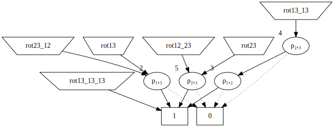

# xDD - various types of Binary Decision Diagram

This crate contains implementations of
* BDD - binary decision diagrams
* ZDD - zero suppressed binary decision diagrams
* MBDD - multiset binary decision diagrams (used to represent multisets rather than sets)
* MZDD - multiset zero suppressed binary decision diagrams
* πDD - permutation decision diagrams based on Swaps, with ZDD or MZDD backend
* Rot-πDD - permutation decision diagrams based on rotations, with ZDD or MZDD backend

This is all done through lots of generic arguments. 

## How does this compare to other decision diagram crates

xDD implements lots of different types of decision diagrams, and is focussed
on the use of xDDs in combinatorics problems rather than equivalency.

If you have a combinatorics problem, this is probably a good crate for you.
If you are doing IC design it probably isn't.

It is currently very complete in terms of types of decision diagrams covered, far beyond any
other crate I know of, but it
only contains the more common algorithms (like union, intersection, not, cardinality).

## What is a BDD or ZDD?

A BDD is a binary decision diagram, a way of representing a boolean function f(v0,v1,..vn)
of boolean variables. It turns out to be compact in many real world situations. A ZDD is a
variant that tends to be somewhat more efficient when most variables are false for most
cases where f(v0,v1,..vn) is true

They are well described by Donald Knuth, "The Art of Computer Programming", Volume 4, Fascicle 1.

[tests/chessboard_coverings.rs](tests/chessboard_coverings.rs) shows an example of a BDD or
ZDD could be used to efficiently count the number of ways a chessboard could be covered
by dominoes, as described on page 119 and 120 of Knuth's book.

[tests/directed_animals.rs](tests/directed_animals.rs) shows an example of a BDD or ZDD being used
to enumerate directed animals on a square lattice, a task it can do but is not particularly efficient
at (but is a fine example and integration test).

## What is a MBDD or MZDD?

A BDD is generally thought of as a function f(v0,v1,..vn) from a set of boolean variables to a 
boolean variable. Another way of thinking about it is as a set S where the tuple (v0,v1,..vn) is an element
of S iff f(v0,v1,..vn) is true.

A multiset is like a set except elements may be present in the set more than once. Each element has
a multiplicity which is the number of times it is in the set. if A and B are sets, then the multiplicity
of an element in A union B is the multiplicity of the element in A plus the multiplicity of that element
in B. Set intersection is the same except for multiplication. Note that there exist other definitions
of multiset union and intersection used in other applications.

A MBDD is an extension to a BDD that represents multisets in this manner.

Alternatively, one can think of it as a function f(v0,v1,..vn) from a set of boolean variables to a
non-negative integer, such that (f∪g)(v0,v1,..vn) = f(v0,v1,..vn)+g(v0,v1,..vn), and
(f∩g)(v0,v1,..vn) = f(v0,v1,..vn)*g(v0,v1,..vn). 

A MZDD is the same except based on a ZDD rather than a BDD.

An example application is in [examples/pap.rs](examples/pap.rs) which computes the number of
permutations of length n that contain a given pattern p exactly k times for all k. A
paper analyzing the results and describing the implementation of MBDDs and MZDDs
[is included in this repository](theory_paper.pdf) or available on [archiv](https://arxiv.org/pdf/2306.12682.pdf).

## What is a πDD or a Rot-πDD

These permutation decision diagrams are two ways of encoding sets of permutations
using a BDD or ZDD or MBDD or MZDD as a backend.

πDD were introduced by Shin-ichi Minato: πDD: A New Decision Diagram for Efficient Problem Solving
in Permutation Space. In Theory and Applications of Satisfiability Testing - SAT 
2011 - 14th International Conference, SAT 2011, Ann Arbor, MI, USA, June 19-
22, 2011. Proceedings, volume 6695 of Lecture Notes in Computer Science, pages
90–104. Springer, Berlin, Heidelberg, 2011

Rot-πDD is a similar data structure that performs better in many situations,
[Yuma Inoue, Studies on Permutation Set Manipulation based on Decision Diagrams,
Doctor of Info. Sciences thesis, Hokkaido University, (2017).](https://eprints.lib.hokudai.ac.jp/dspace/handle/2115/65366?locale=en&lang=en)

These have been typically backed by a ZDD but can be usefully backed by
a MZDD as in [examples/pap.rs](examples/pap.rs).

## General idea for using this library

To make a diagram you will use a factory, and then a particular diagram will be
a reference to a line in the table in that factory. This is similar to the approach
in Knuth above. This allows
construction of progressively more complex combinatorial objects.

These factories implement the [DecisionDiagramFactory] trait.

For a BDD or MBDD, use *BDDFactory*. For a ZDD or MZDD use *ZDDFactory*.
These factories are both parameterized by two generics:
* The first is the type used
to hold a row index in the table of BDDs (the HI and LO pointers in Knuth's terminology).
This is typically a u32 for 2022 era memory sizes - many bytes are needed for each
entry : some for the table entry, and more for the hash tables used to preserve 
uniqueness. However for some big memory systems a longer integer may be used. 
* The
second is the type that should be used for storing the multiplicity for this
MBDD or MZDD. For a MBDD or MZDD this would typically be a u32 or u64; for a 
BDD or a ZDD it would be the special zero memory use NoMultiplicity. 

Cheatsheet:
* For a BDD use BDDFactory<u32,NoMultiplicity>
* For a ZDD use ZDDFactory<u32,NoMultiplicity>
* For a MBDD use BDDFactory<u32,u32>
* For a MZDD use ZDDFactory<u32,u32>

Doesn't having a BDD be a special case of a MBDD cause efficiency reduction? 
Not really. There are a few very minor slightly longer code paths of insignificant
extent; it is comparable to the rust standard library's implementation of HashSet as a special
case of HashMap with a zero length key.

A πDD or Rot-πDD is represented by a PermutationDecisionDiagramFactory which is
parameterized by three generic arguments:
 * the unit type of rotation (Swap for πDD and LeftRotation for Rot-πDD)
 * The type used to hold a row index (see above)
 * The type used to hold multiplicity (see above)

Cheetsheet:
 * for a πDD as used by Minato in the above reference, use PermutationDecisionDiagramFactory::<Swap,u32,NoMultiplicity>
 * for a Rot-πDD as used by Inoue in the above reference, use PermutationDecisionDiagramFactory::<LeftRotation,u32,NoMultiplicity>
 * for a Rot-πDD with multiplicity as used in [examples/pap.rs](examples/pap.rs) use PermutationDecisionDiagramFactory::<LeftRotation,u32,u32>.

## Cardinality / number of solutions / generating functions.

Getting the number of solutions to a xDD is a common requirement in combinatorics
problems. In the simplest case this is just an integer number of solutions, as
produced by Algorithm C in the Knuth description. 

Code would typically be something like
```rust
fn enumate() {
    let num_variables : u16 = 4; // the number of variables in the BDD
    let mut factory = BDDFactory::<u32,NoMultiplicity>::new(num_variables); // create the factory
    let node = set_up_combinatorics_problem(&mut factory); // whatever your problem is
    let num_solutions : u128 = factory.number_solutions(node);
    println!("Answer is {}",num_solutions);
}
```

The number_solutions function implements Algorithm C in a very general manner, parameterized
by result type. When the generic parameter is u64 or u128 (more may be added in a future
release), the result is the simple integer number of solutions.

However there are a variety of items that one may wish to extract from an xDD, which
use algorithms very similar to Algorithm C.

If the generic parameter is `SingleVariableGeneratingFunction<u64>` (or other integral
argument) then the result is an array giving the number of solutions of the diagram
separated by the number of variables that are true in the solution. This is the 
generating function described on page 74 of the Knuth reference.

If the generic parameter is `SingleVariableGeneratingFunctionFixedLength<10>` or similar
then the result is like `SingleVariableGeneratingFunction<u64>` except the resulting
array is truncated to length 10. 

If the genetic parameter is `GeneratingFunctionSplitByMultiplicity<u64>` or similar
then the result is an array giving the number of solutions split by their multiplicity.
This is used in [examples/pap.rs](examples/pap.rs).

A variety of other things are possible; you can define your own by implementing
the `GeneratingFunctionWithMultiplicity` trait.

## Visualizing diagrams

You can generate a file suitable for [Graphviz](https://graphviz.org/doc/info/lang.html) in the
[dot](https://graphviz.org/doc/info/lang.html) format using the `make_dot_file` function.

An example picture I created when debugging permutation composition is:



The trapezia are start nodes; the ellipses are decision points, and the rectangles
are the terminals. The numbers to the upper left of each ellipse are the node indices.
If multiplicities are involved, edges will be labeled with the multiplicity. Dotted lines
are taken if the given variable is false, full lines if the variable is true. 

## Finding Solutions

Finding a solution means finding an assignment to a set of variables that makes the function true.

There are a variety of solution techniques available with xDDs, of which I intend to implement some.

Currently, the only function is to compute an exemplar solution using the minimum number of variables.
This can be used to solve a variety of optimization problems.

## Future

The number of variables is currently a u16. I considered making this generic, although
there are already so many generic arguments I don't want to add to the complexity for
new users. If someone really wants this, please contact me on github.

Similarly for other desired features, please contact me on github. No promises, but
I will listen to requests.

## License

Copyright 2022-2023 Andrew Conway.

Licensed under either of

* Apache License, Version 2.0
  ([LICENSE-APACHE](LICENSE-APACHE) or http://www.apache.org/licenses/LICENSE-2.0)
* MIT license
  ([LICENSE-MIT](LICENSE-MIT) or http://opensource.org/licenses/MIT)

at your option.

## Contribution

Unless you explicitly state otherwise, any contribution intentionally submitted
for inclusion in the work by you, as defined in the Apache-2.0 license, shall be
dual licensed as above, without any additional terms or conditions.

